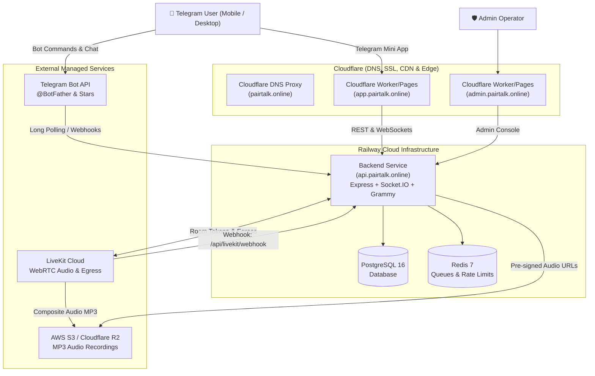

# PairTalk — Ultimate Production Deployment Guide 🚀
**Domain**: `pairtalk.online`  
**Architecture**: Cloudflare + Railway (Node.js + PostgreSQL + Redis) + LiveKit Cloud

---

## 🗺️ Production Architecture Map



---

## 📋 Subdomain Allocation & URLs

| Subdomain / URL | Target Service | Purpose |
| :--- | :--- | :--- |
| **`api.pairtalk.online`** | Railway Web Service | Backend API, WebSockets signaling, and webhooks |
| **`app.pairtalk.online`** | Cloudflare Workers/Pages | Telegram Mini App voice interface |
| **`admin.pairtalk.online`** | Cloudflare Workers/Pages | Black Diamond Operations Admin Console |
| **`pairtalk.online`** | Cloudflare Proxy | Root landing page / Legal policies (`/privacy`, `/guidelines`) |

---

## ⚡ STEP 1: LiveKit Cloud Setup (Voice & Recordings)

1. Sign up / Log in to [cloud.livekit.io](https://cloud.livekit.io).
2. Create a new project named **`pairtalk-production`**.
3. Go to **Settings** → **Keys** and copy your credentials:
   * **`LIVEKIT_HOST`**: e.g., `wss://pairtalk-xxxx.livekit.cloud` (or `https://pairtalk-xxxx.livekit.cloud`)
   * **`LIVEKIT_API_KEY`**: `APIxxxxxxxxx`
   * **`LIVEKIT_API_SECRET`**: `sec_xxxxxxxx`
4. *(Optional — Audio Recordings)* If using S3/R2 storage for recordings:
   * Go to **Settings** → **Egress** in LiveKit.
   * Add your S3 / Cloudflare R2 bucket credentials.

---

## 🚂 STEP 2: Railway Infrastructure Setup

### 2.1 Create Project & Provision Databases
1. Log in to [railway.com](https://railway.com) (or `railway.app`).
2. Click **New Project** → **Provision PostgreSQL**.
3. In the same project, click **+ New** → **Database** → **Add Redis**.

### 2.2 Deploy the Backend Service
1. In your Railway project, click **+ New** → **GitHub Repo**.
2. Select your repository: **`pairtalk/PairTalk-Production`** (or `abdumutolib-404/telegram-p2p-voice-call`).
3. Under service **Settings**:
   * **Root Directory**: `server`
   * **Build Command**: `npm ci && npm run build`
   * **Start Command**: `npm start`
   * *(Or use root Dockerfile)*

### 2.3 Set Railway Environment Variables
In your Railway backend service → **Variables**, add:

```ini
# --- Runtime & Server ---
PORT=3001
NODE_ENV=production

# --- Database & Cache (Use Railway References) ---
DATABASE_URL=${{Postgres.DATABASE_URL}}
REDIS_URL=${{Redis.REDIS_URL}}

# --- Telegram Bot ---
BOT_TOKEN=1234567890:AAHxxxxxx_YourTelegramBotToken
PAYMENTS_BOT_TOKEN=1234567890:AAHxxxxxx_YourPaymentsBotToken_Optional

# --- Admin Security (Stealth 2FA) ---
ADMIN_TELEGRAM_IDS=123456789,987654321
MASTER_PASSWORD=YourSuperStrongMasterPassword2026!
JWT_SECRET=GenerateA64CharRandomSecretForAdminJwtAuth!

# --- LiveKit WebRTC ---
LIVEKIT_HOST=https://pairtalk-xxxx.livekit.cloud
LIVEKIT_API_KEY=APIxxxxxxxxxxxxxxxx
LIVEKIT_API_SECRET=sec_xxxxxxxxxxxxxxxx

# --- Public Domain URLs & CORS ---
MINI_APP_URL=https://app.pairtalk.online
ADMIN_PANEL_URL=https://admin.pairtalk.online
ALLOWED_ORIGINS=https://pairtalk.online,https://app.pairtalk.online,https://admin.pairtalk.online,https://api.pairtalk.online,https://web.telegram.org

# --- Storage & Policies ---
RECORDINGS_DIR=./recordings
PRIVACY_POLICY_URL=https://app.pairtalk.online/privacy
COMMUNITY_GUIDELINES_URL=https://app.pairtalk.online/guidelines

# --- Manual UZS Card Requisites ---
MANUAL_PAYMENT_ADMIN_USERNAME=PairTalkSupport
MANUAL_PAYMENT_ADMIN_CHAT_ID=123456789
MANUAL_PAYMENT_CARD_HOLDER=8600 1234 5678 9012 (PairTalk Official)
MANUAL_PAYMENT_INSTRUCTIONS=1. Transfer exact amount to the card.\n2. Save receipt screenshot or PDF.\n3. Send receipt here in bot for verification.
```

### 2.4 Attach Custom Domain in Railway
1. In the backend service, go to **Settings** → **Public Networking** → **Custom Domain**.
2. Enter: **`api.pairtalk.online`**.
3. Railway will display a DNS target (e.g. `xxxx.up.railway.app`). Copy this for Cloudflare DNS.

---

## ⛅ STEP 3: Cloudflare Domain & DNS Setup

1. Log in to [dash.cloudflare.com](https://dash.cloudflare.com).
2. Click **Add a Site** → Enter `pairtalk.online` → Select the **Free plan**.
3. Change your domain nameservers at your domain registrar to the 2 Cloudflare nameservers provided (e.g., `aria.ns.cloudflare.com` & `noah.ns.cloudflare.com`).
4. Under **SSL/TLS** → Set encryption mode to **Full (Strict)**.
5. In **DNS** → **Records**, add the following:

| Type | Name | Content / Target | Proxy Status | TTL |
| :--- | :--- | :--- | :--- | :--- |
| **CNAME** | `api` | `xxxx.up.railway.app` *(from Railway)* | **DNS only (Grey Cloud)** | Auto |
| **CNAME** | `app` | `pairtalk-production.pages.dev` *(or Worker)* | **Proxied (Orange Cloud)** | Auto |
| **CNAME** | `admin` | `pairtalk-admin.pages.dev` *(or Worker)* | **Proxied (Orange Cloud)** | Auto |
| **CNAME** | `@` | `app.pairtalk.online` | **Proxied (Orange Cloud)** | Auto |

> [!IMPORTANT]
> Keep `api.pairtalk.online` set to **DNS Only (Grey Cloud)** or ensure WebSockets are enabled so Socket.IO and WebRTC signaling connect without HTTP timeout interruptions.

---

## 📱 STEP 4: Cloudflare Frontend Deployments

### 4.1 Deploy Mini App (`/client`)
1. In Cloudflare Dashboard → **Workers & Pages** → **Create Application** → **Pages** (or Workers).
2. Connect your GitHub repository (`pairtalk/PairTalk-Production`).
3. Build Settings:
   * **Project Name**: `pairtalk-production`
   * **Framework Preset**: `Vite`
   * **Root Directory**: `client`
   * **Build Command**: `npm ci && npm run build`
   * **Build Output Directory**: `dist`
4. Add Environment Variable:
   * `VITE_SERVER_URL`: `https://api.pairtalk.online`
5. Go to **Custom Domains** → Add **`app.pairtalk.online`**.

### 4.2 Deploy Admin Panel (`/admin`)
1. Create a second Pages project from the same repository.
2. Build Settings:
   * **Project Name**: `pairtalk-admin`
   * **Framework Preset**: `Vite`
   * **Root Directory**: `admin`
   * **Build Command**: `npm ci && npm run build`
   * **Build Output Directory**: `dist`
3. Add Environment Variable:
   * `VITE_API_URL`: `https://api.pairtalk.online`
4. Go to **Custom Domains** → Add **`admin.pairtalk.online`**.

---

## 🤖 STEP 5: Telegram Bot & BotFather Configuration

Open Telegram, talk to [@BotFather](https://t.me/BotFather):

### 1. Set Menu Button (Mini App Launch Button)
```
/setmenubutton
Select your bot -> @YourPairTalkBot
Button Text: 📞 Practice Speaking
Web App URL: https://app.pairtalk.online
```

### 2. Set Bot Commands
```
/setcommands
Select your bot -> Paste:
start - Start practicing IELTS speaking
profile - View your speaking band and stats
plans - View subscription plans & pricing
recordings - Access your call recordings
favorites - Call your favorite partners
paysupport - Billing support & order status
support - Help, FAQ & unban appeals
```

### 3. Set Description & About
```
/setdescription
Select your bot -> Paste:
🎙️ PairTalk — Real IELTS Speaking Practice with peer learners worldwide. Match by sub-scores, practice real speaking tasks, and improve your band score!
```

---

## 🔗 STEP 6: LiveKit Webhook Configuration

1. Log in to [cloud.livekit.io](https://cloud.livekit.io) → Select your project.
2. Go to **Settings** → **Webhooks** → **Add Webhook**.
3. Enter Webhook URL:
   ```
   https://api.pairtalk.online/api/livekit/webhook
   ```
4. Select Events:
   * ✅ `egress_started`
   * ✅ `egress_ended`
   * ✅ `room_started`
   * ✅ `room_finished`
5. Click **Save Webhook**.

---

## 🧪 STEP 7: Production Smoke Test Checklist

Once deployed, verify the full end-to-end lifecycle:

- [ ] **1. Telegram Bot**: Open Telegram, send `/start` to your bot. Check onboarding flow and alias generation.
- [ ] **2. Mini App Launch**: Tap the **"📞 Practice Speaking"** menu button. Confirm the radar screen opens cleanly.
- [ ] **3. Matchmaking & Voice Call**:
  - Open Mini App on Device A and Device B.
  - Tap **Find Partner**.
  - Confirm match connection, LiveKit audio token generation, and real two-way audio.
- [ ] **4. Audio Recording**: Toggle **Record** during call. End call and check `/recordings` in bot.
- [ ] **5. Telegram Stars**: Send `/plans` → Select **PLUS Plan** → Buy with Telegram Stars (Test invoice). Verify instant activation.
- [ ] **6. Manual Card Payment**: Select **Card Payment** → Send a sample receipt photo/PDF. Verify admin receives notification.
- [ ] **7. Admin Console**:
  - Open `https://admin.pairtalk.online`.
  - Enter Master Password → Check Telegram bot for 6-digit OTP → Enter OTP.
  - Verify Overview Dashboard, Users, Payments Queue, and Appeals Queue load with real data.

---

## 🛡️ STEP 8: Security & Operations Checklist

1. **Database Backups**: Enable Automated Daily Backups in Railway PostgreSQL settings.
2. **Logs & Monitoring**: Railway provides live container logs and CPU/RAM metrics under the **Metrics** tab.
3. **Secret Hygiene**: Ensure all default passwords and secrets in `.env` are replaced with strong cryptographically generated strings.

Your production environment for **`pairtalk.online`** is fully prepared! 🎉
