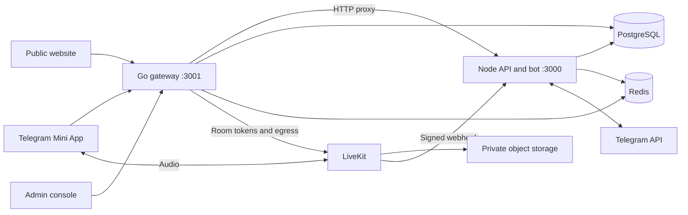

# PairTalk architecture

Reviewed 2026-10-05. Runtime definitions are [Dockerfile](../server/Dockerfile), [entrypoint](../server/docker-entrypoint.sh), [Node startup](../server/src/index.ts), and [Go startup](../gateway/cmd/gateway/main.go).

## Services and traffic

The Go gateway handles `/healthz`, Socket.IO signaling and the gateway's WebSocket transport. Other HTTP requests reach Express through the configured Node upstream. The Docker entrypoint sets Node's port to 3000 and waits for its health before starting Go. A required child exiting stops the other. Node defaults to listening on all interfaces unless `HOST` is set; container network exposure must not be confused with a hard-coded loopback bind.

Frontend serving is implemented in [frontendRouting.ts](../server/src/services/frontendRouting.ts). Shared-host routes distinguish the public landing, `/client`, and `/admin`; dedicated app/admin hosts are also supported. Frontend bundles use same-origin API defaults unless public build-time variables override them. The landing is pre-rendered; the Mini App and admin are client applications and are marked noindex.

## Shared state and side effects

PostgreSQL owns users, entitlements, sessions, payments, feedback, and durable jobs. Redis coordinates matchmaking, leases, rate limits, OTP challenges, and Pub/Sub. Redis events are wake-up hints for durable post-call work, not the sole source of accounting or delivery.

Node and Go both implement call admission/completion. Shared database invariants must hold in each implementation. Completion locks the session and users, commits terminal state and accounting once, and writes a PostCallJob in the same transaction. The Node worker handles post-call processing and durable notifications. Redis-based bot leadership prevents multiple polling owners for the same token.

## Security boundaries

- Telegram launch data determines identity. Client-supplied user IDs, plan claims, and completion reasons do not authorize account or room mutations.
- Active room membership is checked before retained readiness or recording state is allocated.
- Completion and timeout use persisted admission time. Delayed readiness cannot reset duration or skip accounting.
- Admin login uses a configured password and a one-time Telegram challenge. Redis-backed challenge consumption has no local shadow fallback.
- Stars settlement rechecks current entitlements under the user lock. Unapplied incompatible payments enter refund recovery without revoking a separate valid subscription.
- Recording intent is separate from saved owner access. Generated keys are tracked before external egress; late outputs remain eligible for cleanup.
- Suspicious HTTP traffic is rejected without request-triggered persistent global IP penalties.
- Every question CSV path uses shared formula neutralization; stored text and JSON are unchanged.

LiveKit transport encryption is not a claim of end-to-end secrecy from the media service. Physical-device audio, provider behavior, and production capacity require staging measurements.

## Sources of truth

| Concern | Source |
| --- | --- |
| Database models and indexes | [schema.prisma](../server/prisma/schema.prisma) |
| Entitlements | [plan.ts](../server/src/services/plan.ts), [planConfiguration.ts](../server/src/services/planConfiguration.ts), [Go plans](../gateway/internal/database/plans.go) |
| Terminal calls | [Node completion](../server/src/services/callCompletion.ts), [Go completion](../gateway/internal/database/call_lifecycle.go) |
| Recording lifecycle | [recordingLifecycle.ts](../server/src/services/recordingLifecycle.ts), [Go queries](../gateway/internal/database/queries.go) |
| Durable post-call processing | [postCallOutbox.ts](../server/src/services/postCallOutbox.ts) |
| Notification delivery | [telegramTransport.ts](../server/src/bot/telegramTransport.ts) |
| Public aggregates | [publicStats.ts](../server/src/routes/publicStats.ts) |

See [Operations](OPERATIONS.md) for remaining release requirements.
