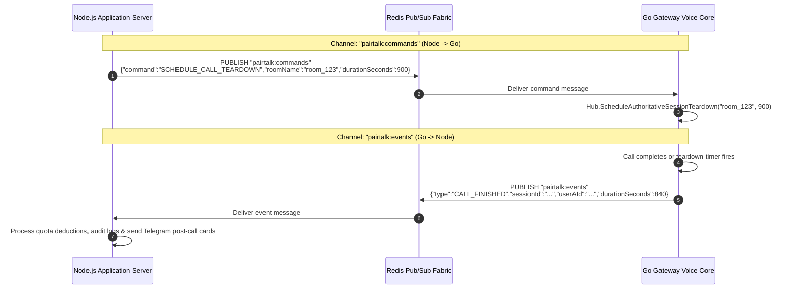

# PairTalk Platform Architecture & Subsystem Specification

> **Target Standard**: Cloudflare / Stripe / AWS Enterprise Systems Architecture  
> **Target Audience**: Infrastructure Engineers, Distributed Systems Architects, Senior Developers

---

## 1. Executive Architectural Blueprint

PairTalk operates on a **4-tier hybrid architecture** optimized for ultra-low latency audio streaming, high-throughput WebSocket signaling, fault-tolerant bot orchestration, and secure administrative operations:

1. **Edge & Ingress Gateway (Go 1.26.5)**: High-concurrency reverse proxy, Socket.IO v4 signaling server, atomic Redis matchmaking engine, and LiveKit SFU token dispenser.
2. **Core Application Server (Node.js 20+ / TypeScript)**: Express REST services, grammY Bot high-concurrency runner under distributed Redis leader election, Prisma ORM data modeling, Gemini 2.0 Flash IELTS curation, and event listeners.
3. **Frontend Applications (React 19.2.8 + Vite 8.2.0)**: Telegram Mini App client (WebRTC media player, audio visualizer, questions drawer) and Operations Admin Console (stealth 2FA, live telemetry).
4. **Data & Media Infrastructure**: PostgreSQL 16 (relational database), Redis 7 (in-memory state, atomic queues, Pub/Sub IPC, sliding rate limits), LiveKit SFU (WebRTC audio mesh), and AWS S3 / Cloudflare R2 (composite MP3 egress).

```mermaid
graph TB
    subgraph Clients["Clients & Edge Consumers"]
        TMA["Telegram Mini App (React 19)"]
        Browser["Web / Mobile Browser (React 19)"]
        Admin["Admin Operations Console"]
        TGServer["Telegram Cloud Bot Servers"]
    end

    subgraph Tier1["Tier 1: Go Voice & Ingress Gateway (Port 3001)"]
        Gin["Gin Routing & Security Engine"]
        Proxy["Reverse Proxy (httputil.SingleHostReverseProxy)"]
        SIO["Socket.IO v4 Protocol Engine (Gorilla WS)"]
        Lua["Atomic Matchmaking Engine (Redis Lua)"]
        LKSDK["LiveKit Server SDK v2"]
        Grace["15s Grace & Teardown Timers"]
        PubSub["Go Redis Pub/Sub Client"]
    end

    subgraph Tier2["Tier 2: Node.js Application Core (Port 3000)"]
        Express["Express 4.19 REST Engine"]
        LeaderLock["Distributed Leader Lock (pairtalk:bot:leader:lock)"]
        BotRunner["grammY Bot Runner (Sequential/Parallel)"]
        EventSub["Redis Events Subscriber (pairtalk:events)"]
        Gemini["Gemini 2.0 Flash AI Curation"]
        Prisma["Prisma ORM 5.12 Client"]
    end

    subgraph Tier3["Tier 3: Distributed State & In-Memory Fabric"]
        RDB[(Redis 7)]
        subgraph RedisNamespaces["Redis Topologies"]
            R_Queue["match_queue:* & user_queue:*"]
            R_Lock["match_lock:* & leader:lock"]
            R_PubSub["pairtalk:events & pairtalk:commands"]
            R_RL["rl:* & penalty:* & inflight:*"]
        end
    end

    subgraph Tier4["Tier 4: Relational Database & Media Fabric"]
        PG[(PostgreSQL 16 Multi-Index Cluster)]
        SFU["LiveKit Cloud SFU (WebRTC Mesh)"]
        S3["AWS S3 / Cloudflare R2 (MP3 Egress)"]
    end

    %% Client Ingress
    TMA -->|WSS /socket.io/*| SIO
    Browser -->|WSS /socket.io/*| SIO
    TMA -->|HTTPS /api/*| Gin
    Browser -->|HTTPS /api/*| Gin
    Admin -->|HTTPS /api/admin/*| Gin
    TGServer -->|Webhook / Polling| BotRunner

    %% Gateway Internal Routing
    Gin -->|"/socket.io/*"| SIO
    Gin -->|"/healthz"| Gin
    Gin -->|"/*" (All HTTP Traffic)| Proxy
    Proxy -->|Local HTTP/1.1| Express

    %% Gateway Signaling & Matching
    SIO <--> Lua
    Lua <--> R_Queue
    Lua <--> R_Lock
    SIO --> LKSDK
    LKSDK --> SFU
    SIO --> Grace
    Grace --> PubSub
    PubSub -->|Publish CALL_FINISHED| R_PubSub
    R_PubSub -->|Subscribe SCHEDULE_CALL_TEARDOWN| SIO

    %% Server Interactions
    LeaderLock <--> R_Lock
    BotRunner -.->|Active Leader| LeaderLock
    EventSub -->|Listen CALL_FINISHED| R_PubSub
    EventSub --> BotRunner
    Express -->|Publish SCHEDULE_CALL_TEARDOWN| R_PubSub
    Express <--> Prisma
    BotRunner <--> Prisma
    Prisma <--> PG
    Express <--> R_RL

    %% Media Fabric
    SFU -->|WebRTC Opus Streams| TMA
    SFU -->|WebRTC Opus Streams| Browser
    SFU -->|Automated Egress MP3| S3
```

---

## 2. Subsystem Specifications

### 2.1 Go Voice & Ingress Gateway (`gateway/`)

- **Host & Port**: Binds public `0.0.0.0:3001` (or `$PORT`).
- **Runtime**: Go 1.26.5 compiled as a standalone static binary with zero external runtime dependencies.
- **Key Responsibilities**:
  1. **HTTP Ingress & Reverse Proxy**: All incoming HTTP traffic is inspected by Gin. Route `/healthz` responds directly with gateway status. Routes matching `/socket.io/*` are handed over to the Socket.IO signaling engine. All other requests (`/api/*`, `/client/*`, `/admin/*`, `/`) are transparently proxied to the Node.js backend (`http://127.0.0.1:3000`).
  2. **Socket.IO v4 Engine**: Implements the Engine.IO v4 handshake protocol over WebSocket with HTTP long-polling fallback. Enforces Telegram WebApp `initData` HMAC-SHA256 authentication on connection.
  3. **Atomic Redis Matchmaking Engine**: Executes `MatchQueueMultiClaimScript` Lua script to atomically query priority queues (`BOSS`, `PRO`, `PLUS`), complementary skill buckets (`match_queue:<band>:<weak>:<strong`), and fallback band pools (`match_queue:band:<band>`). Prevents race conditions and phantom pairings.
  4. **LiveKit Room Token Dispenser**: Computes strict call duration limits based on participants' plan entitlements, generating scoped WebRTC connection JWTs containing identity, room grant, audio permissions, and duration metadata.
  5. **15-Second Disconnect Grace Period**: When a peer's WebSocket drops, the room is kept open for 15 seconds. If the peer reconnects, state is restored seamlessly (`partner_reconnected`). If the timer expires, the call is authoritatively terminated (`partner_connection_lost`).
  6. **Authoritative Duration Teardown Timer**: Runs an unalterable server-side timer (`time.AfterFunc`) matching the calculated call limit (15 to 90 min). When fired, it stops any active audio egress, marks the database session `COMPLETED`, deducts daily call quotas, deletes the LiveKit room, notifies clients with `call_finished`, and publishes `CALL_FINISHED` via Redis.
  7. **Active Session Reconciliation & Zombie Sweeper**: Reconciles dangling active sessions on startup and sweeps orphan rooms every 5 minutes (`zombie.go`).

### 2.2 Node Application Server (`server/`)

- **Host & Port**: Binds internal `127.0.0.1:3000`.
- **Runtime**: Node.js 20+ with TypeScript 5.4.5 executed via `tsx`/`ts-node` in development and compiled `dist/index.js` in production.
- **Key Responsibilities**:
  1. **REST API Core**: Powers candidate authentication, IELTS content delivery, audio recording presigned URLs, LiveKit egress webhooks, and administrative control planes.
  2. **Telegram Bot (`grammY` + `@grammyjs/runner`)**: Provides interactive user onboarding, criteria calibration keyboards, IELTS test simulation prompts, manual card payment receipt processing, and post-call feedback cards.
  3. **Distributed Leader Election (`DistributedLeaderLock`)**: Coordinates multi-instance cluster deployments to ensure exactly one Node instance runs Telegram Bot polling and background cron schedules, eliminating duplicate message deliveries.
  4. **Crawler & Gemini 2.0 Flash Sanitizer**: Daily background worker scraping authentic IELTS Speaking test recall questions from public educational portals, categorizing them across Parts 1, 2, and 3, and validating pedagogical validity using Google Gemini 2.0 Flash.
  5. **Redis Event Subscriber**: Subscribes to `pairtalk:events` on Redis. Upon receiving `CALL_FINISHED`, decrements user call quotas, schedules retention expiry, and dispatches rich post-call summary cards via Telegram.

### 2.3 Client Mini App (`client/`)

- **Technology**: React 19.2.8, Vite 8.2.0, Tailwind CSS v4.0.9, `livekit-client` 2.9.2, `socket.io-client` 4.8.1.
- **Deployment**: Served as static assets or inside the Telegram Mini App iframe.
- **Key Responsibilities**:
  1. **Telegram WebApp SDK Integration**: Binds `window.Telegram.WebApp`, validates user session, adapts colors to Telegram theme parameters, and controls native haptics.
  2. **Radar Matchmaking UI**: Visualizes criteria calibration (FC, LR, GRA, P sliders), displays queue status, and transitions into active calls.
  3. **WebRTC In-Call Experience**: Real-time audio waveform visualizer using Web Audio API (`AnalyserNode`), mute/unmute audio track toggles, IELTS topic questions drawer, and mutual call completion buttons.
  4. **Connection Loss & Reconnection Banner**: Displays a 15-second countdown timer when partner connectivity drops, maintaining audio context until reconnect or termination.

### 2.4 Admin Operations Console (`admin/`)

- **Technology**: React 19.2.8, Vite 8.2.0, Tailwind CSS v4.0.9, Lucide React 1.31.0.
- **Deployment**: Mounted under `/admin` route or separate operational subdomain (`admin.pairtalk.online`).
- **Key Responsibilities**:
  1. **Stealth 2FA Authentication**: Two-phase login requiring master system password followed by a single-use OTP dispatched to authorized Telegram administrators.
  2. **Cluster Health & Real-Time Telemetry**: Real-time observability dashboard displaying database ping latency, Redis memory usage, queue bucket member distributions, and active WebRTC rooms.
  3. **Candidate Moderation & Dispute Desk**: One-click user ban/suspension controls, plan entitlement overrides, manual card payment receipt verification, and disciplinary ban appeal adjudications.

---

## 3. Reverse Proxy Architecture (`net/http/httputil`)

The Go Gateway acts as the public ingress router, enforcing network boundary isolation. The reverse proxy implementation (`gateway/internal/proxy/reverse_proxy.go`) wraps Go's standard `httputil.NewSingleHostReverseProxy`:

```go
func NewReverseProxy(targetURL string) (*ReverseProxy, error) {
    u, err := url.Parse(targetURL)
    if err != nil {
        return nil, err
    }
    p := httputil.NewSingleHostReverseProxy(u)

    origDirector := p.Director
    p.Director = func(req *http.Request) {
        origDirector(req)
        req.Host = u.Host
    }

    return &ReverseProxy{
        proxy:  p,
        target: u,
    }, nil
}
```

### Ingress Route Routing Table

| Ingress Path Pattern | Handler Layer | Protocol | Invariant / Behavior |
| :--- | :--- | :--- | :--- |
| `GET /healthz` | Go Gateway Engine | HTTP/1.1 | Responds immediately with Gateway health, uptime, and timestamp without hitting Node.js. |
| `ANY /socket.io/*` | Go Gateway Signaling Hub | WebSocket / Polling | Intercepted by Gorilla WebSocket engine for real-time signaling. Never forwarded to Node.js. |
| `GET /health` | Node.js Backend via Proxy | HTTP/1.1 | Forwarded to Node.js. Validates PostgreSQL connectivity via Prisma and returns DB connection state. |
| `POST /api/auth/verify` | Node.js Backend via Proxy | HTTP/1.1 | Forwarded to Node.js. Validates Telegram `initData` HMAC-SHA256 signature and returns session profile. |
| `POST /api/livekit/webhook`| Node.js Backend via Proxy | HTTP/1.1 | Forwarded to Node.js. Verified via LiveKit `WebhookReceiver` cryptographic header. |
| `GET/POST /api/admin/*` | Node.js Backend via Proxy | HTTP/1.1 | Forwarded to Node.js. Enforces JWT cookie / Bearer auth and stealth 2FA session verification. |
| `GET /robots.txt`, `/sitemap.xml` | Node.js Backend via Proxy | HTTP/1.1 | Forwarded to Node.js. Dynamic SEO crawlers and bot filtering responses. |
| `/*` (All other routes) | Node.js Backend via Proxy | HTTP/1.1 | Static client bundle serving, landing page pre-rendered HTML, and Mini App entrypoints. |

---

## 4. Inter-Process Communication (IPC) Bridge

Communication between the Go Gateway and Node.js Server is decoupled via high-performance **Redis Pub/Sub** channels, ensuring non-blocking operations and zero inter-service HTTP coupling.



### 4.1 Channel: `pairtalk:events` (Go Gateway -> Node Server)

Published by the Go Gateway when a call session transitions to `COMPLETED` or is aborted after the 5-second minimum billable threshold.

```json
{
  "type": "CALL_FINISHED",
  "sessionId": "a8f3b2c1-d4e5-4a6b-8c7d-9e0f1a2b3c4d",
  "roomName": "room_7b9d1e2f-3a4b-5c6d-7e8f-9a0b1c2d3e4f",
  "userAId": "usr_99214488-3321-41aa-bb22-110022334455",
  "userBId": "usr_11002233-4455-6677-8899-aabbccddeeff",
  "userATelegramId": "123456789",
  "userBTelegramId": "987654321",
  "userAAlias": "P2P-Partner-7821",
  "userBAlias": "P2P-Partner-4412",
  "durationSeconds": 842,
  "recordingUrl": "recordings/room_7b9d1e2f-3a4b-5c6d-7e8f-9a0b1c2d3e4f.mp3",
  "retentionDaysA": 30,
  "retentionDaysB": 7,
  "reason": "call_duration_limit_reached",
  "requesterId": "usr_99214488-3321-41aa-bb22-110022334455"
}
```

### 4.2 Channel: `pairtalk:commands` (Node Server -> Go Gateway)

Published by the Node Server to command the Go Gateway to take authoritative signaling actions on active rooms.

```json
{
  "command": "SCHEDULE_CALL_TEARDOWN",
  "roomName": "room_7b9d1e2f-3a4b-5c6d-7e8f-9a0b1c2d3e4f",
  "durationSeconds": 900
}
```

---

## 5. Bot Runner & Distributed Leader Election

To prevent duplicate processing of Telegram webhooks or long-polling updates when horizontally scaled across multiple containers (e.g. Railway replicas or Kubernetes pods), the platform implements an atomic **Distributed Leader Lock** in `server/src/services/leaderLock.ts`.

### 5.1 Leadership Algorithm Invariants

1. **Acquisition**: Every instance attempts to acquire the lock at boot time using:
   ```text
   SET pairtalk:bot:leader:lock <instanceId> PX 15000 NX
   ```
   Only the first node successfully writes the key and becomes the `Leader`.
2. **Instance ID Format**: Cryptographically unique per node process: `node_${process.pid}_${crypto.randomUUID().slice(0, 8)}`.
3. **Heartbeat Renewal**: The leader executes a renewal Lua script every `5,000ms`:
   ```lua
   if redis.call('GET', KEYS[1]) == ARGV[1] then
     return redis.call('PEXPIRE', KEYS[1], ARGV[2])
   else
     return 0
   end
   ```
4. **Standby Polling**: Standby nodes poll every `4,000ms` attempting non-blocking `acquire()` calls.
5. **Crash Failover**: If the leader crashes or network partitions, the Redis key expires in `15,000ms`. The next standby node to poll acquires leadership immediately and launches the `grammY` bot runner.
6. **Clean Release**: On graceful SIGINT/SIGTERM shutdown, the leader executes an atomic release:
   ```lua
   if redis.call('GET', KEYS[1]) == ARGV[1] then
     return redis.call('DEL', KEYS[1])
   else
     return 0
   end
   ```
