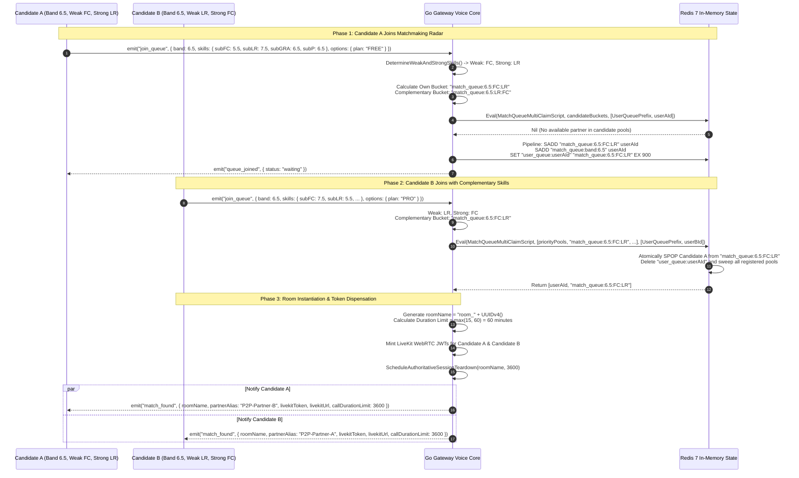
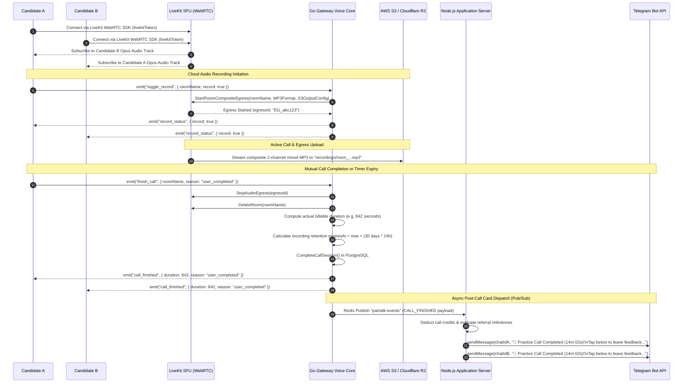
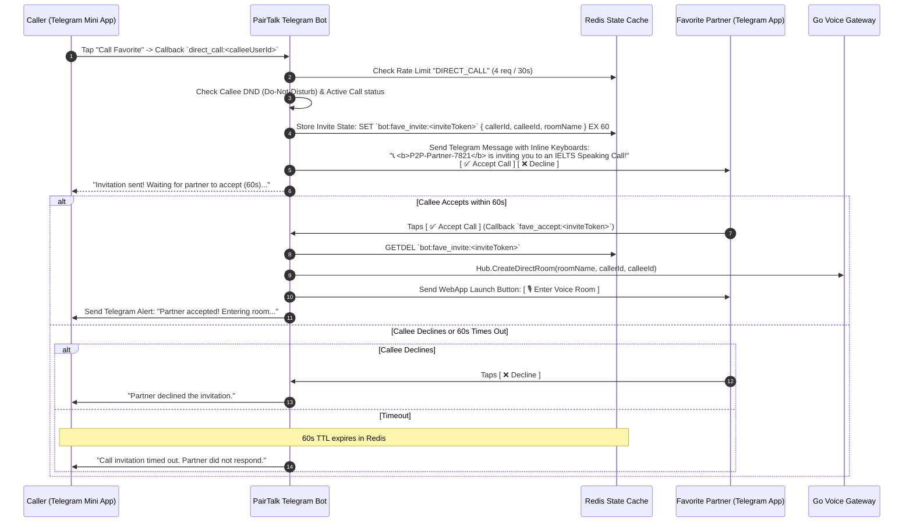
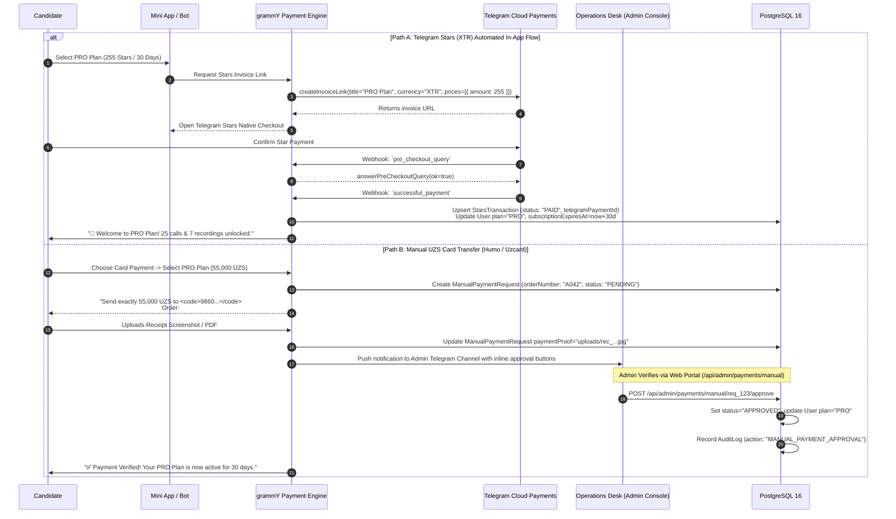
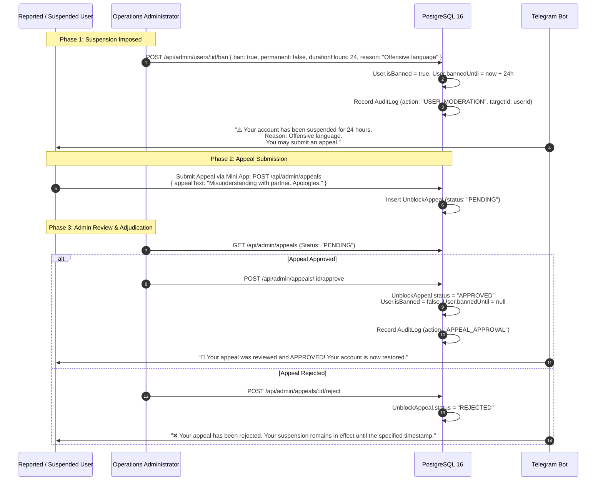

# PairTalk End-to-End Circulation Workflows

> **Standard**: Cloudflare / Stripe Architecture Sequencing Standards  
> **Audience**: Systems Integrators, Core Engineers, Product Engineers  
> **Diagram Format**: Mermaid.js Sequence & State Diagrams

---

## 1. Matchmaking Queue Circulation

The PairTalk Matchmaking Engine executes non-blocking atomic Redis Lua routines to evaluate IELTS whole-band competencies and pair candidates with complementary strengths.

### Technical Invariants

1. **Deterministic Skill Resolution**: Sub-criteria scores are sorted stably: `FC (0) -> LR (1) -> GRA (2) -> P (3)`. Ties preserve stable index order.
2. **Progressive Bucket Search Order**:
   - Priority Queues (`match_queue:priority:BOSS`, `PRO`, `PLUS`).
   - Exact Complementary Match at same band (`match_queue:<band>:<strongSkill>:<weakSkill>`).
   - Same Skill Profile at same band (`match_queue:<band>:<weakSkill>:<strongSkill>`).
   - Same Band General Fallback (`match_queue:band:<band>`).
   - Adjacent Bands ($\pm 0.5$ and $\pm 1.0$ general pools).
3. **Ghost Prevention**: When Candidate A is matched, the atomic Lua script deletes their `user_queue:userAId` pointer and removes them from all candidate sets simultaneously.

---

## 2. Voice Call & Cloud Audio Egress Circulation

---

## 3. Direct Call to Favorite Partner Circulation

Allows candidates to call saved practice partners directly with a 60-second invitation timeout.

---

## 4. Upgrade Payment Circulation (Telegram Stars & Manual UZS Card)

PairTalk provides dual-path payment processing to serve global users (Telegram Stars) and regional candidates in Central Asia (Uzbekistan Som Humo/Uzcard transfers).

---

## 5. Disciplinary & Ban Appeal Circulation

Enforces platform conduct standards while providing a transparent, audited appeal review mechanism.

