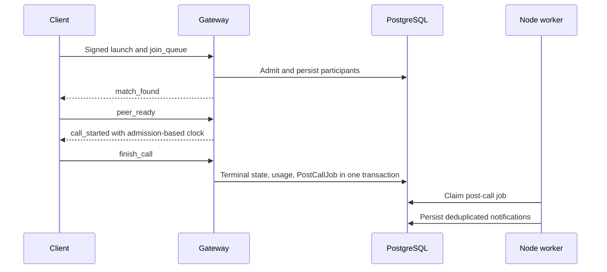

# Application workflows

Reviewed 2026-10-05. These are lifecycle summaries, not latency or delivery guarantees.

## Match and call

1. A signed Telegram launch establishes identity.
2. Admission checks current moderation, entitlement, and active-session ownership.
3. Redis matchmaking claims candidates; PostgreSQL stores the participants and admission time.
4. The gateway provides room-scoped LiveKit credentials.
5. Both canonical participants send readiness. A remaining-duration timer uses admission time; readiness cannot reset it.
6. Finish, timeout, disconnect recovery, or cleanup reaches shared transactional completion.
7. Completion commits terminal state, applicable usage, and one PostCallJob. Node processes durable post-call work.

## Recording

Authorize membership, lock current state, persist the predicted output key, then start provider egress. Save the winning binding and owner set. Stop clears active intent, not saved access. Signed finalization archives actual keys; a superseded egress cannot overwrite the latest URL. Retention cleanup deletes every tracked key, retains failures, and rereads metadata under lock after external deletion.

## Stars purchase and refund

Validate the invoice and current tier at precheckout. At settlement, lock the user and recheck current entitlement before applying the purchase. Record an incompatible captured payment as unapplied and start refund recovery. Provider confirmation precedes revocation; an unapplied refund must not revoke another entitlement. Duplicate charge settlement and competing refund requests remain guarded by persistent state.

Manual UZS payments use a separate review/proof workflow; they are not an automatic Stars conversion.

## Notifications and uncertain outcomes

Durable jobs have leases and deduplication. Lost Redis messages do not lose persisted post-call work. An uncertain Telegram send is marked UNCONFIRMED for operator review; it must not be automatically resent as if delivery had definitely failed. Bulk announcements and some legacy producers remain best effort.

See [Architecture](ARCHITECTURE.md), [State and storage](STATE_AND_STORAGE.md), and [Operations](OPERATIONS.md) for source links and recovery boundaries.
