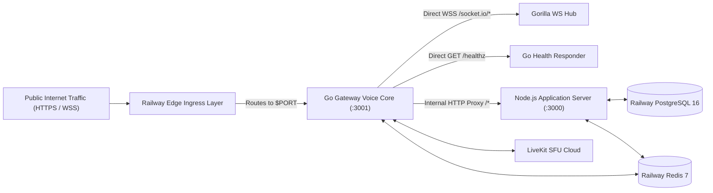

# PairTalk Environment Configuration & Deployment Guide

> **Standard**: Cloudflare / Stripe Production Engineering & Infrastructure Standards  
> **Supported Environments**: Local Development, Docker Compose, Railway, Multi-Container Cloud Fabric

---

## 1. Environment Variables Configuration Dictionary

### 1.1 Go Voice & Ingress Gateway (`gateway/`)

| Variable Name | Type | Default | Required in Prod | Description & Semantics |
| :--- | :--- | :--- | :--- | :--- |
| `PORT` | Integer | `3001` | Yes | Ingress listening port for public HTTP and WebSocket traffic. Set automatically by Railway to `$PORT`. |
| `NODE_URL` | String | `http://127.0.0.1:3000` | Yes | Internal upstream address of the Node.js backend for reverse proxying. |
| `DATABASE_URL` | String | `postgresql://...` | Yes | PostgreSQL connection string used by `jackc/pgx/v5` connection pool. |
| `REDIS_URL` | String | `redis://127.0.0.1:6379`| Yes | Redis connection string used for matchmaking Lua scripts and Pub/Sub IPC. |
| `BOT_TOKEN` | String | `""` | Yes | Telegram Bot token used to verify `initData` HMAC signatures on WebSocket handshakes. |
| `LIVEKIT_HOST` / `LIVEKIT_URL` | String | `""` | Yes | WebSocket/HTTP host of LiveKit SFU (e.g. `https://pairtalk.livekit.cloud`). `LIVEKIT_URL` accepted as alias. |
| `LIVEKIT_API_KEY` | String | `""` | Yes | LiveKit API Key used for minting room access tokens and composite egress. |
| `LIVEKIT_API_SECRET`| String | `""` | Yes | LiveKit API Secret used for cryptographic JWT signing. |
| `S3_KEY` | String | `""` | Optional | AWS IAM Access Key ID for cloud audio recording storage. |
| `S3_SECRET` | String | `""` | Optional | AWS IAM Secret Access Key. |
| `S3_BUCKET` | String | `""` | Optional | S3 bucket name (e.g. `pairtalk-recordings`). |
| `S3_REGION` | String | `eu-north-1` | Optional | AWS region where the bucket is deployed. |
| `S3_ENDPOINT` | String | `""` | Optional | Custom S3-compatible endpoint (leave empty for standard AWS; use for MinIO/R2). |
| `S3_FORCE_PATH_STYLE`| Boolean| `false` | Optional | Set `true` for MinIO path-style bucket URLs. |
| `ADMIN_TELEGRAM_IDS`| String | `""` | Yes | Comma-separated numeric Telegram IDs granted unlimited bypass privileges. |
| `RECORDINGS_DIR` | String | `recordings` | Optional | Local fallback directory for temporary audio files. |
| `NODE_ENV` | String | `development` | Yes | Set to `production` to activate Gin release mode and strict HMAC validation. |

---

### 1.2 Node.js Application Server (`server/`)

| Variable Name | Type | Default | Required in Prod | Description & Semantics |
| :--- | :--- | :--- | :--- | :--- |
| `PORT` | Integer | `3000` | Yes | Internal HTTP listening port for Express REST endpoints. |
| `NODE_ENV` | String | `development` | Yes | `"development"`, `"test"`, or `"production"`. Production enforces strict security invariants. |
| `DATABASE_URL` | String | - | Yes | PostgreSQL connection string for Prisma ORM. |
| `REDIS_URL` | String | - | Yes | Redis connection string for `ioredis`, leader election, and sliding rate limiters. |
| `BOT_TOKEN` | String | - | Yes | Telegram Bot API token from @BotFather. |
| `PAYMENTS_BOT_TOKEN`| String | `""` | Optional | Dedicated outbound bot token for payment notification dispatches. |
| `MINI_APP_URL` | String | - | Yes | Canonical public URL of the Mini App frontend (e.g. `https://pairtalk.online/client`). |
| `ADMIN_PANEL_URL` | String | - | Yes | Canonical public URL of the Admin panel (e.g. `https://pairtalk.online/admin`). |
| `ALLOWED_ORIGINS` | String | `""` | Yes | Comma-separated list of allowed CORS web origins. |
| `ADMIN_TELEGRAM_IDS`| String | - | Yes | Comma-separated Telegram IDs of authorized operations administrators. |
| `MASTER_PASSWORD` | String | - | Yes | Master password for Admin Stealth 2FA. Insecure default strictly rejected in production. |
| `JWT_SECRET` | String | - | Yes | Secret key for signing admin session cookies. Insecure default strictly rejected in production. |
| `LIVEKIT_HOST` | String | - | Yes | LiveKit SFU host. |
| `LIVEKIT_API_KEY` | String | - | Yes | LiveKit API Key. |
| `LIVEKIT_API_SECRET`| String | - | Yes | LiveKit API Secret. |
| `MANUAL_PAYMENT_ADMIN_USERNAME` | String | `PairTalkSupport` | Optional | Support username displayed for payment assistance. |
| `MANUAL_PAYMENT_ADMIN_CHAT_ID` | String | - | Yes | Telegram Chat ID receiving instant receipt notifications. |
| `MANUAL_PAYMENT_CARD_HOLDER` | String | Default string | Optional | Organization name displayed on payment prompts. |
| `MANUAL_PAYMENT_INSTRUCTIONS` | String | Default string | Optional | Step-by-step instructions displayed when selecting card transfer. |
| `S3_KEY` | String | - | Optional | AWS IAM Access Key for S3 Presigned URLs. |
| `S3_SECRET` | String | - | Optional | AWS IAM Secret Access Key. |
| `S3_BUCKET` | String | - | Optional | S3 Bucket name for audio recordings. |
| `S3_REGION` | String | `us-east-1` | Optional | AWS Region for recording bucket. |
| `S3_ENDPOINT` | String | - | Optional | Custom S3 endpoint URL. |
| `S3_FORCE_PATH_STYLE`| Boolean| `false` | Optional | Enable path-style S3 URLs. |
| `PRIVACY_POLICY_URL`| String | `https://pairtalk.online/privacy` | Optional | Public privacy policy reference. |
| `COMMUNITY_GUIDELINES_URL` | String | `https://pairtalk.online/community-guidelines` | Optional | Public guidelines reference. |
| `GEMINI_API_KEY` | String | `""` | Optional | Google Gemini API key for automated IELTS question curation. |
| `GEMINI_MODEL` | String | `gemini-2.0-flash` | Optional | Gemini model identifier for AI curation. |

---

### 1.3 Client Mini App & Admin Panel (`client/`, `admin/`)

| Variable Name | Type | Default | Description |
| :--- | :--- | :--- | :--- |
| `VITE_API_URL` | String | `""` (Same-origin) | Base HTTP URL for REST API calls (defaults to current origin). |
| `VITE_WS_URL` | String | `""` (Same-origin) | Base WebSocket URL for Socket.IO signaling. |
| `VITE_BOT_USERNAME` | String | `PairTalkBot` | Target Telegram Bot username for deep-linking. |

---

## 2. Step-by-Step Local Development Setup

Follow these steps to launch the complete local development ecosystem:

### 2.1 Infrastructure Spin-Up

Ensure Docker is running, then start the containerized databases:

```bash
# Start PostgreSQL 16 and Redis 7 in detached mode
docker-compose up -d postgres redis

# Check container health status
docker-compose ps
```

### 2.2 Server Database Migration & Dependencies

```bash
cd server
npm install

# Push schema directly to local PostgreSQL
npx prisma db push

# Generate typed Prisma client
npx prisma generate
```

### 2.3 Starting Services in Parallel

**1. Go Gateway Core (Port 3001)**:
```bash
cd gateway
go run ./cmd/gateway
# Listening on :3001, proxying non-WS traffic to http://127.0.0.1:3000
```

**2. Node Application Core (Port 3000)**:
```bash
cd server
npm run dev
# Express REST and grammY Bot listening on internal port 3000
```

**3. React Mini App Client (Port 5173)**:
```bash
cd client
npm install
npm run dev
# Vite server running at http://localhost:5173
```

**4. React Admin Panel (Port 5174)**:
```bash
cd admin
npm install
npm run dev
# Vite server running at http://localhost:5174
```

---

## 3. Production Deployment Architecture (Docker & Railway)

### 3.1 Multi-Stage Production Dockerfile

PairTalk includes an enterprise multi-stage build in the root [`Dockerfile`](file:///D:/telegram-p2p-voice-call/Dockerfile):

```dockerfile
# Stage 1: Build Go Gateway
FROM golang:1.26-alpine AS gateway-builder
WORKDIR /app/gateway
COPY gateway/go.mod gateway/go.sum ./
RUN go mod download
COPY gateway/ ./
RUN CGO_ENABLED=0 GOOS=linux go build -ldflags="-w -s" -o /gateway-bin ./cmd/gateway

# Stage 2: Build Node Server & Prisma
FROM node:20-alpine AS server-builder
WORKDIR /app/server
COPY server/package*.json ./
RUN npm ci
COPY server/ ./
RUN npx prisma generate
RUN npm run build

# Stage 3: Build React Frontends
FROM node:20-alpine AS client-builder
WORKDIR /app
COPY client/package*.json ./client/
RUN cd client && npm ci
COPY client/ ./client/
RUN cd client && npm run build

# Stage 4: Minimal Runtime Container
FROM node:20-alpine
WORKDIR /app
COPY --from=gateway-builder /gateway-bin /usr/local/bin/gateway
COPY --from=server-builder /app/server/dist ./server/dist
COPY --from=server-builder /app/server/node_modules ./server/node_modules
COPY --from=server-builder /app/server/package.json ./server/
COPY --from=server-builder /app/server/prisma ./server/prisma
COPY --from=client-builder /app/client/dist ./public/client

# Supervised start script launches Node (3000) then Go (PORT)
CMD ["sh", "-c", "node server/dist/index.js & gateway"]
```

---

### 3.2 Railway Multi-Container Network Ingress

In production deployments (such as Railway):



1. **Ingress Routing**: Railway binds public traffic to the port designated by `$PORT` (typically 3001 or dynamically assigned).
2. **Go Gateway Execution**: Go binds `$PORT`. Any non-WebSocket route is proxied internally to `http://127.0.0.1:3000`.
3. **Node Server Execution**: Node runs in the background on `127.0.0.1:3000`. It only accepts local traffic from the Go proxy, ensuring complete boundary isolation.

---

## 4. Production Readiness Checklist

Before publishing to production, verify each invariant:

- [ ] **Master Password**: Ensure `MASTER_PASSWORD` is changed from the default `admin123456`. Production startup will halt if the default password is used.
- [ ] **JWT Secret**: Ensure `JWT_SECRET` is at least 32 cryptographically random bytes. Production startup will halt if the default key is used.
- [ ] **Admin Telegram IDs**: Set `ADMIN_TELEGRAM_IDS` with valid numeric Telegram IDs. Stealth 2FA OTP codes are dispatched exclusively to these accounts.
- [ ] **LiveKit Production Keys**: Confirm `LIVEKIT_HOST`, `LIVEKIT_API_KEY`, and `LIVEKIT_API_SECRET` reference production cloud credentials. Default `devkey`/`secret` is blocked in production mode.
- [ ] **CORS Origins**: Configure `ALLOWED_ORIGINS` with exact production subdomains (`https://pairtalk.online`, `https://app.pairtalk.online`).
- [ ] **Health Probes**: Ensure container orchestrator uses `/healthz` for gateway liveness and `/health` for deep system readiness.
- [ ] **Git Remote Safety**: Ensure deployments pull strictly from the authoritative production repository with locked write access.
