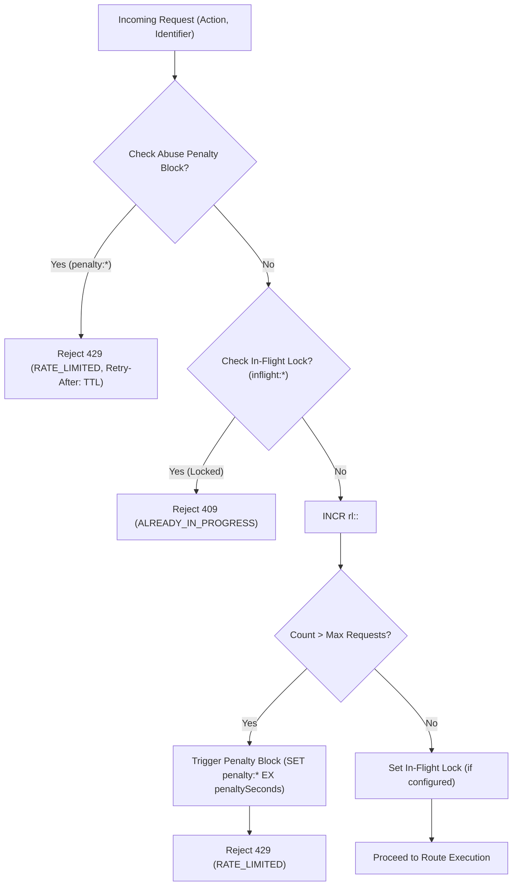

# PairTalk State & Storage Engine Specification

> **Standard**: Cloudflare / Stripe Database & Cache Architecture Specification  
> **Engines**: PostgreSQL 16 (Relational Store) + Redis 7 (In-Memory Fabric)  
> **Schema Management**: Prisma ORM 5.12 (`server/prisma/schema.prisma`)

---

## 1. PostgreSQL 16 Relational Schema Dictionary

The relational persistence tier comprises **13 Prisma models** optimized for transactional consistency, referential integrity, and high-concurrency composite index lookups.

### 1.1 `User`
Represents candidate profiles, criteria calibration sub-scores, plan tiers, and disciplinary states.

| Column | Type | Attributes / Defaults | Description |
| :--- | :--- | :--- | :--- |
| `id` | `String` | `@id @default(uuid())` | Primary key UUID. |
| `telegramId` | `BigInt` | `@unique` | Canonical Telegram numeric user ID. |
| `alias` | `String` | `@unique` | Anonymous call alias (e.g. `P2P-Partner-7821`). |
| `subFC` | `Float` | `@default(6.0)` | Fluency & Coherence sub-score (0.0 - 9.0). |
| `subLR` | `Float` | `@default(6.0)` | Lexical Resource sub-score (0.0 - 9.0). |
| `subGRA` | `Float` | `@default(6.0)` | Grammatical Range & Accuracy sub-score (0.0 - 9.0). |
| `subP` | `Float` | `@default(6.0)` | Pronunciation sub-score (0.0 - 9.0). |
| `band` | `Float` | `@default(6.0)` | Target whole-band score. |
| `plan` | `String` | `@default("FREE")` | Plan tier: `"FREE"`, `"PLUS"`, `"PRO"`, `"BOSS"`. |
| `subscriptionStatus` | `String` | `@default("NONE")` | `"NONE"`, `"ACTIVE"`, `"PENDING_UPGRADE"`, `"EXPIRED"`, `"CANCELLED"`, `"REFUNDED"`. |
| `subscriptionExpiresAt`| `DateTime?`| Nullable | Expiration timestamp for active paid tier. |
| `customPlanName` | `String?` | Nullable | Name of custom or rewarded plan. |
| `maxDuration` | `Int` | `@default(15)` | Maximum call duration in minutes. |
| `dailyLimit` | `Int` | `@default(3)` | Calls limit per billing period. |
| `dailyCallsUsed` | `Int` | `@default(0)` | Practice calls consumed during current period. |
| `retentionOverride` | `Int?` | Nullable | Custom audio recording retention in days. |
| `recordingLimitOverride`| `Int?`| Nullable | Custom recordings limit. |
| `referredByUserId` | `String?` | Nullable | User ID of inviter. |
| `referredAt` | `DateTime?`| Nullable | Timestamp of referral attribution. |
| `lastCallDate` | `String?` | Nullable | Date string `YYYY-MM-DD` of last completed call. |
| `warningCount` | `Int` | `@default(0)` | Accumulated misconduct warnings. |
| `isBanned` | `Boolean` | `@default(false)` | Temporary suspension flag. |
| `bannedUntil` | `DateTime?`| Nullable | Expiration timestamp of temporary suspension. |
| `isPermanentlyBanned` | `Boolean` | `@default(false)` | Irreversible ban flag. |
| `dnd` | `Boolean` | `@default(false)` | Do-Not-Disturb flag rejecting direct calls. |
| `onboarded` | `Boolean` | `@default(false)` | Completed initial bot onboarding tutorial. |
| `createdAt` | `DateTime` | `@default(now())` | Creation timestamp. |
| `updatedAt` | `DateTime` | `@updatedAt` | Last modification timestamp. |

**Indexes**:
- `@@index([subscriptionExpiresAt])`
- `@@index([isBanned])`

---

### 1.2 `CallSession`
Tracks WebRTC voice rooms, participants, LiveKit egress, and billing durations.

| Column | Type | Attributes / Defaults | Description |
| :--- | :--- | :--- | :--- |
| `id` | `String` | `@id @default(uuid())` | Primary key UUID. |
| `roomName` | `String` | `@unique` | Cryptographic room identifier (`room_<uuid>`). |
| `userAId` | `String` | References `User.id` | First participant ID. |
| `userBId` | `String` | References `User.id` | Second participant ID. |
| `status` | `String` | `@default("ACTIVE")` | `"ACTIVE"`, `"COMPLETED"`, `"CANCELLED"`. |
| `egressId` | `String?` | Nullable | LiveKit cloud egress identifier. |
| `recordingUrl` | `String?` | Nullable | S3 object key for composite MP3 audio. |
| `recordingExpiresAt` | `DateTime?`| Nullable | Expiration timestamp for S3 recording file. |
| `recordedByUserId` | `String?` | Nullable | User ID of participant who enabled recording. |
| `duration` | `Int` | `@default(0)` | Call duration in billable seconds. |
| `createdAt` | `DateTime` | `@default(now())` | Room creation timestamp. |
| `endedAt` | `DateTime?`| Nullable | Room termination timestamp. |

**Indexes**:
- `@@index([userAId, status, createdAt])`
- `@@index([userBId, status, createdAt])`
- `@@index([egressId])`
- `@@index([status])`
- `@@index([recordingExpiresAt])`
- `@@index([status, recordingUrl, createdAt])`

---

### 1.3 `CallRating`
Post-call feedback, 1-5 star ratings, and misconduct reporting.

| Column | Type | Attributes / Defaults | Description |
| :--- | :--- | :--- | :--- |
| `id` | `String` | `@id @default(uuid())` | Primary key UUID. |
| `callId` | `String` | References `CallSession.id` | Associated call session. |
| `raterId` | `String` | References `User.id` | User giving the rating. |
| `ratedId` | `String` | References `User.id` | User receiving the rating. |
| `stars` | `Int` | `1` to `5` | Numeric score. |
| `feedback` | `String?` | Nullable | Qualitative comments or report details. |
| `reported` | `Boolean` | `@default(false)` | Flagged for administrative moderation review. |
| `createdAt` | `DateTime` | `@default(now())` | Submission timestamp. |

**Indexes**:
- `@@index([ratedId])`
- `@@index([callId])`

---

### 1.4 `UnblockAppeal`
Candidate disciplinary ban appeal tickets.

| Column | Type | Attributes / Defaults | Description |
| :--- | :--- | :--- | :--- |
| `id` | `String` | `@id @default(uuid())` | Primary key UUID. |
| `userId` | `String` | References `User.id` | Appellants user ID. |
| `telegramId` | `BigInt` | - | Appellant's Telegram ID. |
| `alias` | `String` | - | Appellant's alias. |
| `banReason` | `String` | - | Reason suspension was imposed. |
| `appealText` | `String` | - | Candidate's explanation/defense. |
| `status` | `String` | `@default("PENDING")` | `"PENDING"`, `"APPROVED"`, `"REJECTED"`. |
| `createdAt` | `DateTime` | `@default(now())` | Submission timestamp. |
| `reviewedAt` | `DateTime?`| Nullable | Adjudication timestamp. |

**Indexes**:
- `@@index([status, createdAt])`
- `@@index([userId])`

---

### 1.5 `StarsTransaction`
Telegram Stars in-app purchase ledger.

| Column | Type | Attributes / Defaults | Description |
| :--- | :--- | :--- | :--- |
| `id` | `String` | `@id @default(uuid())` | Primary key UUID. |
| `orderNumber` | `String?` | Nullable | Human-readable order number. |
| `userId` | `String` | References `User.id` | Buyer's user ID. |
| `telegramPaymentId` | `String` | `@unique` | Canonical Telegram Stars payment charge ID. |
| `starsAmount` | `Int` | - | Amount paid in Stars (`XTR`). |
| `planTier` | `String` | `"PLUS"`, `"PRO"`, `"BOSS"` | Purchased plan tier. |
| `status` | `String` | `@default("PAID")` | `"PAID"`, `"REFUND_PENDING"`, `"REFUNDED"`. |
| `refundReason` | `String?` | Nullable | Reason for refund if revoked. |
| `refundedAt` | `DateTime?`| Nullable | Refund timestamp. |
| `createdAt` | `DateTime` | `@default(now())` | Transaction timestamp. |

**Indexes**:
- `@@index([userId, status])`

---

### 1.6 `ManualPaymentRequest`
Manual UZS Humo/Uzcard bank transfer desk.

| Column | Type | Attributes / Defaults | Description |
| :--- | :--- | :--- | :--- |
| `id` | `String` | `@id @default(uuid())` | Primary key UUID. |
| `orderNumber` | `String` | `@default("A0")` | Human-readable tracking number (`A042`). |
| `userId` | `String` | References `User.id` | Buyer's user ID. |
| `telegramId` | `BigInt` | - | Buyer's Telegram ID. |
| `alias` | `String` | - | Buyer's alias. |
| `plan` | `String` | `"PLUS"`, `"PRO"`, `"BOSS"` | Selected tier. |
| `uzsAmount` | `Int` | - | Amount in Uzbek Som (e.g. `55000`). |
| `paymentProof` | `String?` | Nullable | Receipt image/PDF file path. |
| `status` | `String` | `@default("PENDING")` | `"PENDING"`, `"APPROVED"`, `"REJECTED"`, `"REFUND_PENDING"`, `"REFUNDED"`. |
| `refundCardNumber`| `String?`| Nullable | Card number for refund disbursement. |
| `refundProof` | `String?` | Nullable | Proof of refund transfer. |
| `refundReason` | `String?` | Nullable | Dispute explanation. |
| `adminNote` | `String?` | Nullable | Internal operator notes. |
| `reviewedBy` | `String?` | Nullable | Admin ID who adjudicated request. |
| `reviewedAt` | `DateTime?`| Nullable | Adjudication timestamp. |
| `createdAt` | `DateTime` | `@default(now())` | Request timestamp. |

**Indexes**:
- `@@index([userId, status])`
- `@@index([status, createdAt])`

---

### 1.7 `AuditLog`
Immutable administrative operations audit trail.

| Column | Type | Attributes / Defaults | Description |
| :--- | :--- | :--- | :--- |
| `id` | `String` | `@id @default(uuid())` | Primary key UUID. |
| `action` | `String` | - | `"MANUAL_PAYMENT_APPROVAL"`, `"MANUAL_PAYMENT_REJECTION"`, `"STARS_REFUND_REVOKE"`, `"PLAN_UPDATE"`, `"USER_MODERATION"`, `"SET_RETENTION"`. |
| `targetId` | `String?` | Nullable | Target user, payment, or question ID. |
| `adminId` | `String` | - | ID of executing administrator. |
| `beforeState` | `String?` | Nullable | JSON snapshot prior to action. |
| `afterState` | `String?` | Nullable | JSON snapshot post action. |
| `reason` | `String?` | Nullable | Operator justification. |
| `createdAt` | `DateTime` | `@default(now())` | Execution timestamp. |

**Indexes**:
- `@@index([action, createdAt])`
- `@@index([targetId])`

---

### 1.8 `FavoritePartner`
Saved practice buddy relations between candidates.

| Column | Type | Attributes / Defaults | Description |
| :--- | :--- | :--- | :--- |
| `id` | `String` | `@id @default(uuid())` | Primary key UUID. |
| `userId` | `String` | References `User.id` | User saving favorite. |
| `partnerId` | `String` | References `User.id` | Favorited user ID. |
| `createdAt` | `DateTime` | `@default(now())` | Save timestamp. |

**Constraints**: `@@unique([userId, partnerId])`.

---

### 1.9 `ReferralReward`
Referral attribution and reward tracking.

| Column | Type | Attributes / Defaults | Description |
| :--- | :--- | :--- | :--- |
| `id` | `String` | `@id @default(uuid())` | Primary key UUID. |
| `userId` | `String` | References `User.id` | Inviter user ID. |
| `referredUserId`| `String` | References `User.id` | Referred friend user ID. |
| `qualifyingCallId`| `String?`| Nullable | Call session ID triggering qualification. |
| `status` | `String` | `@default("AVAILABLE")` | `"AVAILABLE"`, `"USED"`. |
| `expiresAt` | `DateTime?`| Nullable | Optional expiration timestamp. |
| `usedAt` | `DateTime?`| Nullable | Consumed timestamp. |
| `createdAt` | `DateTime` | `@default(now())` | Issuance timestamp. |

**Indexes**:
- `@@index([userId, status])`
- `@@index([createdAt])`

---

### 1.10 `Contest`
Referral championship contest configuration.

| Column | Type | Attributes / Defaults | Description |
| :--- | :--- | :--- | :--- |
| `id` | `String` | `@id @default(uuid())` | Primary key UUID. |
| `title` | `String` | Default string | Championship title. |
| `description` | `String` | Default string | Rules and explanation. |
| `prizes` | `String` | Default string | Multi-line prize definitions. |
| `isActive` | `Boolean` | `@default(false)` | Active contest switch. |
| `startsAt` | `DateTime` | `@default(now())` | Contest start window. |
| `endsAt` | `DateTime?`| Nullable | Contest conclusion window. |
| `createdAt` | `DateTime` | `@default(now())` | Creation timestamp. |
| `updatedAt` | `DateTime` | `@updatedAt` | Last modification timestamp. |

---

### 1.11 `IeltsTopic`
Categorized IELTS speaking themes.

| Column | Type | Attributes / Defaults | Description |
| :--- | :--- | :--- | :--- |
| `id` | `String` | `@id @default(uuid())` | Primary key UUID. |
| `name` | `String` | `@unique` | Topic title (e.g. "Artificial Intelligence"). |
| `slug` | `String` | `@unique` | URL slug (e.g. `artificial-intelligence`). |
| `description` | `String?` | Nullable | Pedagogical guidance. |
| `relevance` | `Int` | `@default(5)` | Frequency / priority rating (`1` to `10`). |
| `sourceMetadata`| `String?`| Nullable | Origin metadata. |
| `isActive` | `Boolean` | `@default(true)` | Active catalog flag. |
| `createdAt` | `DateTime` | `@default(now())` | Creation timestamp. |
| `updatedAt` | `DateTime` | `@updatedAt` | Modification timestamp. |

**Indexes**:
- `@@index([slug, isActive])`
- `@@index([relevance])`

---

### 1.12 `IeltsQuestion`
Curated exam questions across Parts 1, 2, and 3.

| Column | Type | Attributes / Defaults | Description |
| :--- | :--- | :--- | :--- |
| `id` | `String` | `@id @default(uuid())` | Primary key UUID. |
| `topicId` | `String` | References `IeltsTopic.id` | Associated topic. |
| `part` | `IeltsPart` | Enum | `PART_1`, `PART_2`, `PART_3`. |
| `questionText` | `String` | - | Normalized question text. |
| `cueCardBullets`| `String?`| Nullable | JSON array of Part 2 bullet prompts. |
| `questionType` | `String` | `@default("GENERAL")` | `"GENERAL"`, `"CUE_CARD"`, `"DISCUSSION"`, `"FOLLOW_UP"`. |
| `source` | `String` | `@default("OFFICIAL_RECALL")` | Provenance label. |
| `sourceUrl` | `String?` | Nullable | Source scrape URL. |
| `sourceHash` | `String` | `@unique` | Deterministic SHA-256 fingerprint for deduplication. |
| `isActive` | `Boolean` | `@default(true)` | Active delivery flag. |
| `createdAt` | `DateTime` | `@default(now())` | Ingestion timestamp. |
| `updatedAt` | `DateTime` | `@updatedAt` | Modification timestamp. |

**Indexes**:
- `@@index([part, isActive])`
- `@@index([topicId, part, isActive])`

---

### 1.13 `CrawlerSyncLog`
Telemetry log for automated web scraper runs.

| Column | Type | Attributes / Defaults | Description |
| :--- | :--- | :--- | :--- |
| `id` | `String` | `@id @default(uuid())` | Primary key UUID. |
| `status` | `String` | - | `"SUCCESS"`, `"FAILED"`, `"RUNNING"`. |
| `sourcesProcessed`| `Int` | `@default(0)` | Count of web pages parsed. |
| `questionsDiscovered`| `Int` | `@default(0)` | Raw questions identified. |
| `questionsAccepted`| `Int` | `@default(0)` | Sanitized questions committed. |
| `duplicatesSkipped`| `Int` | `@default(0)` | Redundant questions discarded. |
| `topicsCreated` | `Int` | `@default(0)` | New topics created. |
| `errors` | `String?` | Nullable | Stack traces / failure logs. |
| `durationMs` | `Int` | `@default(0)` | Execution duration in ms. |
| `startedAt` | `DateTime` | `@default(now())` | Start timestamp. |
| `completedAt` | `DateTime?`| Nullable | Completion timestamp. |

**Indexes**: `@@index([startedAt])`.

---

## 2. Redis 7 Key Namespace & TTL Matrix

Complete dictionary across all **28 Redis key patterns** running on the cluster:

| # | Key Pattern | Type | Exact TTL | Subsystem | Description & Behavioral Semantics |
| :--- | :--- | :--- | :--- | :--- | :--- |
| 1 | `match_queue:<band>:<weak>:<strong` | Set | `1800s` (30m) | Matchmaking | Primary candidate pool ranked by complementary skills (e.g. `match_queue:6.5:FC:LR`). Members are `userId` strings. |
| 2 | `match_queue:band:<band>` | Set | `1800s` (30m) | Matchmaking | Band-level candidate fallback pool (e.g. `match_queue:band:6.5`). |
| 3 | `match_queue:priority:BOSS` | Set | `1800s` (30m) | Matchmaking | Priority queue for BOSS tier candidates. |
| 4 | `match_queue:priority:PRO` | Set | `1800s` (30m) | Matchmaking | Priority queue for PRO tier candidates. |
| 5 | `match_queue:priority:PLUS` | Set | `1800s` (30m) | Matchmaking | Priority queue for PLUS tier candidates. |
| 6 | `match_queue:global` | Set | `1800s` (30m) | Matchmaking | Catch-all global matchmaking queue set. |
| 7 | `user_queue:<userId>` | String | `900s` (15m) | Matchmaking | Tracks a candidate's registered matchmaking bucket. Automatically cleared upon matching or cancellation. |
| 8 | `match_lock:<userId>` | String | `5000ms` | Gateway | Distributed lock during matchmaking queue entry and atomic claim evaluations. |
| 9 | `pairtalk:bot:leader:lock` | String | `15000ms` | App Server | Distributed leader election lock for the Telegram Bot runner. Renewed every `5,000ms`. |
| 10| `pairtalk:events` | PubSub | Transient | IPC Bridge | Pub/Sub channel for Go Gateway events broadcast (`CALL_FINISHED`). |
| 11| `pairtalk:commands` | PubSub | Transient | IPC Bridge | Pub/Sub channel for commands sent to Go Gateway (`SCHEDULE_CALL_TEARDOWN`). |
| 12| `cache:ielts:questions:<top>:
:<pg>:<lim>`| String | `300s` (5m) | IELTS API | JSON cache of paginated question query responses. Invalidated on CRUD operations. |
| 13| `cache:ielts:topics` | String | `300s` (5m) | IELTS API | JSON cache of active IELTS topics list. |
| 14| `otp:challenge:<challengeId>` | Hash | `300s` (5m) | Admin Auth | Holds stealth 2FA OTP hash, expiration, and remaining attempt counters. |
| 15| `bot:session:<telegramId>` | String | `3600s` (1h) | Telegram Bot | Ephemeral state for Telegram conversational wizard flows. |
| 16| `bot:fave_invite:<inviteToken>` | Hash | `60s` (1m) | Direct Call | Ephemeral state for 60-second direct call invitation prompt. |
| 17| `rl:<poolCategory>:<identifier>` | String | Window-based | Rate Limiter | Sliding window integer counter for distributed rate limiting. |
| 18| `penalty:<poolCategory>:<identifier>` | String | `15s - 3600s` | Rate Limiter | Abuse penalty flag blocking requests from abusive IP/user IDs. |
| 19| `inflight:<action>:<identifier>` | String | `4s - 8s` | Rate Limiter | Concurrency mutex preventing rapid duplicate double-click submissions. |
| 20| `telemetry:ping` | String | `10s` | Telemetry | Temporary key used by health probes to evaluate Redis write/read latency. |
| 21| `contest:leaderboard:cache` | String | `120s` (2m) | Contest | Cached aggregated referral championship leaderboard results. |
| 22| `rate_limit:scanner:ban:<ip>` | String | `86400s` (24h) | Scanner Shield | Malicious bot exploit scanner IP ban flag. |
| 23| `daily_limit:<userId>:<date>` | String | `86400s` (24h) | Billing | Ephemeral daily call quota counter cache. |
| 24| `user:active_session:<userId>` | String | Call Duration | Gateway | Maps user ID to active room name for rapid state reconciliation. |
| 25| `crawler:lock` | String | `1800s` (30m) | Crawler | Mutual exclusion lock preventing concurrent crawler executions. |
| 26| `storage:purge:lock` | String | `600s` (10m) | Storage | Mutual exclusion lock for daily recording storage cleanup cron. |
| 27| `subscription:reminder:lock` | String | `600s` (10m) | Subscriptions | Mutual exclusion lock for subscription expiration sweepers. |
| 28| `surge:alert:lock` | String | `600s` (10m) | Schedulers | Mutual exclusion lock for peak-hour surge notification dispatchers. |

---

## 3. Distributed Rate Limiting Matrix

PairTalk enforces distributed sliding window rate limits and in-flight mutex locks via `server/src/services/rateLimitMatrix.ts`.

### Complete 22-Action Rate Limiting Rules Matrix

| Action Name | Max Req | Window | Penalty Block | In-Flight Mutex | Idempotent | Pool Category | Operational Context |
| :--- | :--- | :--- | :--- | :--- | :--- | :--- | :--- |
| `AUTH_PASSWORD` | `5` | `900s` (15m) | `900s` (15m) | - | No | `auth_password` | Master password attempts during Admin Stealth 2FA. |
| `AUTH_OTP` | `5` | `300s` (5m) | `300s` (5m) | - | No | `auth_otp` | One-time password verification attempts during Admin Stealth 2FA. |
| `AUTH_VERIFY` | `20` | `60s` (1m) | `300s` (5m) | - | No | `auth_verify` | Telegram `initData` HMAC-SHA256 handshake verifications. |
| `MATCH_JOIN` | `10` | `60s` (1m) | `300s` (5m) | `4s` | No | `matchmaking` | Entering the matchmaking radar queue. |
| `MATCH_CANCEL` | `10` | `60s` (1m) | `300s` (5m) | - | Yes | `matchmaking` | Cancelling search in the matchmaking queue. |
| `MATCHMAKING` | `10` | `60s` (1m) | `300s` (5m) | - | No | `matchmaking` | Generic queue polling and radar operations. |
| `DIRECT_CALL` | `4` | `30s` | `300s` (5m) | `8s` | No | `direct_call` | Initiating direct calls to favorite partners. |
| `FAVORITE` | `15` | `30s` | - | - | Yes | `favorite` | Saving or removing practice partners from favorites. |
| `RECORD_START` | `4` | `20s` | `120s` (2m) | `4s` | No | `record_start` | Launching LiveKit cloud composite MP3 recording egress. |
| `RECORD_STOP` | `4` | `20s` | - | - | Yes | `record_stop` | Stopping running audio recording egress. |
| `FINISH_CALL` | `12` | `10s` | - | - | Yes | `finish_call` | Voluntary call completion requests. |
| `APPEAL` | `2` | `3600s` (1h) | `3600s` (1h) | - | No | `appeal` | Submitting disciplinary ban review appeals. |
| `SUPPORT` | `5` | `60s` (1m) | `300s` (5m) | - | No | `support` | Dispatching inquiries to support desk. |
| `PAYMENT_INVOICE` | `5` | `60s` (1m) | `300s` (5m) | - | No | `payment_invoice` | Generating Telegram Stars checkout invoice links. |
| `SUBSCRIPTION_REQUEST`| `3` | `60s` (1m) | `300s` (5m) | - | No | `subscription_request`| Creating manual UZS card payment orders. |
| `BOT` | `30` | `60s` (1m) | `60s` (1m) | - | No | `bot` | General incoming Telegram bot text messages. |
| `BOT_BUTTON` | `60` | `60s` (1m) | `15s` | - | No | `bot` | Interactive inline keyboard button callbacks. |
| `BOT_COMMAND` | `30` | `60s` (1m) | `30s` | - | No | `bot` | Slash command invocations (`/start`, `/profile`, `/help`). |
| `PROFILE_UPDATE`| `6` | `60s` (1m) | `300s` (5m) | - | No | `profile_update`| Calibrating target band descriptors (FC, LR, GRA, P). |
| `DND` | `8` | `30s` | - | - | Yes | `dnd` | Toggling Do-Not-Disturb status. |
| `ADMIN_LOGIN` | `5` | `900s` (15m) | `900s` (15m) | - | No | `admin_login` | Single-step admin panel authentication invocations. |
| `ADMIN_OTP` | `10` | `900s` (15m) | `900s` (15m) | - | No | `admin_otp` | Administrative OTP challenge verification attempts. |
