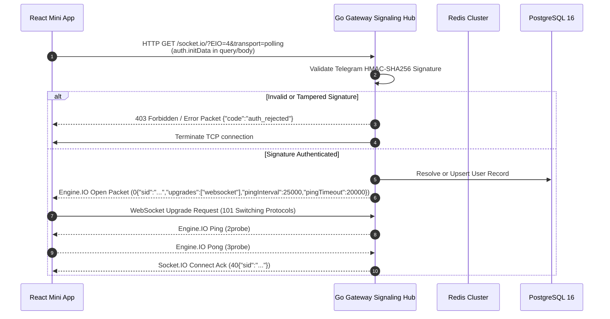
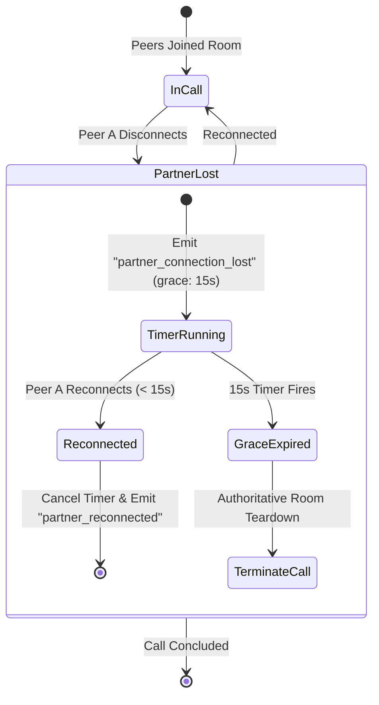

# PairTalk WebSocket & Signaling Protocol Specification

> **Standard**: Socket.IO v4 / Engine.IO v4 Real-Time Protocol Specification  
> **Endpoint**: `wss://pairtalk.online/socket.io/?EIO=4&transport=websocket`  
> **Ingress Layer**: Go 1.26.5 Voice Gateway (`gateway/internal/signaling`)

---

## 1. Engine.IO v4 Protocol & Handshake Lifecycle

PairTalk utilizes the **Engine.IO v4** protocol with full WebSocket-first transport and automatic HTTP long-polling fallback.

### 1.1 Connection Handshake & Authentication

During connection establishment, the client must transmit its Telegram Mini App `initData` signature string within the Socket.IO `auth` dictionary or HTTP query parameters:

```javascript
import { io } from 'socket.io-client';

const socket = io('https://pairtalk.online', {
  transports: ['websocket', 'polling'],
  auth: {
    initData: window.Telegram.WebApp.initData,
  },
  reconnection: true,
  reconnectionAttempts: 10,
  reconnectionDelay: 1000,
  reconnectionDelayMax: 5000,
});
```

#### Handshake Sequence



### 1.2 Engine.IO Packet Type Reference

| Prefix | Name | Semantics |
| :--- | :--- | :--- |
| `0` | **Open** | Sent by Gateway on successful handshake with session ID, ping parameters, and transport upgrades. |
| `1` | **Close** | Terminates connection. |
| `2` | **Ping** | Heartbeat probe sent by Gateway every 25 seconds. |
| `3` | **Pong** | Heartbeat response returned by Client within 20 seconds. |
| `4` | **Message** | Encapsulates Socket.IO event payloads. |
| `40` | **Connect** | Socket.IO namespace connection confirmation. |
| `42` | **Event** | Socket.IO event transmission with event name and JSON payload. |

---

## 2. Client-to-Server Event Catalog

All incoming events are validated, rate-limited via distributed mutexes, and dispatched to the signaling state machine.

### 2.1 `join_queue`

Registers candidate into the criteria matchmaking radar.

- **Action Rate Limit**: `MATCH_JOIN` (10 req / 60s, penalty 300s, 4s in-flight mutex lock).
- **Payload Schema**:
```json
{
  "band": 6.5,
  "skills": {
    "subFC": 6.0,
    "subLR": 7.5,
    "subGRA": 6.5,
    "subP": 6.5
  },
  "options": {
    "plan": "PRO",
    "warningCount": 0
  }
}
```
- **Field Invariants**:
  - `band`: Finite float between `4.0` and `9.0` (rounded to nearest `0.5`).
  - `skills`: Sub-scores (`subFC`, `subLR`, `subGRA`, `subP`) must be finite values between `0.0` and `9.0`.
  - `options.plan`: One of `"FREE"`, `"PLUS"`, `"PRO"`, `"BOSS"`.
- **Outcomes**:
  - Immediate match found: Returns `match_found` to both peers.
  - Waiting in queue: Returns `queue_joined` (`{ "status": "waiting" }`).

---

### 2.2 `cancel_queue`

Removes user from all registered matchmaking buckets and priority pools.

- **Action Rate Limit**: `MATCH_CANCEL` (10 req / 60s, idempotent).
- **Payload**: `{}` (Empty JSON object).
- **Outcome**: Returns `queue_cancelled` (`{ "success": true }`).

---

### 2.3 `toggle_record`

Initiates or terminates LiveKit cloud composite audio recording (MP3).

- **Action Rate Limit**: `RECORD_START` (4 req / 20s, penalty 120s, 4s in-flight mutex).
- **Payload Schema**:
```json
{
  "roomName": "room_7b9d1e2f-3a4b-5c6d-7e8f-9a0b1c2d3e4f",
  "record": true,
  "requestId": "req_8a7f6c5b"
}
```
- **Outcomes**:
  - Success: Emits `record_status` (`{ "record": true }`) to all participants in the room.
  - Failure: Emits `recording_error` (`{ "code": "RECORDING_FAILED", "message": "..." }`).

---

### 2.4 `finish_call`

Signals voluntary end of call by either participant.

- **Action Rate Limit**: `FINISH_CALL` (12 req / 10s, idempotent).
- **Payload Schema**:
```json
{
  "roomName": "room_7b9d1e2f-3a4b-5c6d-7e8f-9a0b1c2d3e4f",
  "reason": "user_completed",
  "requestId": "req_99b8a7c6"
}
```
- **Outcome**: Triggers immediate graceful teardown, emits `call_finished`, stops egress, and publishes `CALL_FINISHED` via Redis.

---

### 2.5 WebRTC Fallback Signaling Events

Used for direct P2P mesh signaling if LiveKit SFU experiences network boundary degradation:

| Event | Direction | Payload Structure |
| :--- | :--- | :--- |
| `offer` | Client -> Server | `{ "roomName": "...", "sdp": RTCSessionDescriptionInit }` |
| `answer` | Client -> Server | `{ "roomName": "...", "sdp": RTCSessionDescriptionInit }` |
| `candidate`| Client -> Server | `{ "roomName": "...", "candidate": RTCIceCandidateInit }` |
| `leave` | Client -> Server | `{ "roomName": "..." }` |

---

## 3. Server-to-Client Event Catalog

### 3.1 `match_found`

Emitted simultaneously to both matched peers when the matchmaking radar completes a match.

```json
{
  "roomName": "room_7b9d1e2f-3a4b-5c6d-7e8f-9a0b1c2d3e4f",
  "partnerId": "usr_11002233-4455-6677-8899-aabbccddeeff",
  "partnerAlias": "P2P-Partner-4412",
  "partnerBand": 7.0,
  "token": "eyJhbGciOiJIUzI1NiIsInR5cCI6IkpXVCJ9...",
  "livekitToken": "eyJhbGciOiJIUzI1NiIsInR5cCI6IkpXVCJ9...",
  "livekitUrl": "https://pairtalk.livekit.cloud",
  "callDurationLimit": 3600,
  "maxDurationSeconds": 3600
}
```

---

### 3.2 `queue_joined`

Emitted when candidate is registered into Redis matchmaking bucket and awaiting partner.

```json
{
  "status": "waiting"
}
```

---

### 3.3 `queue_cancelled`

Emitted upon successful cancellation of queue search.

```json
{
  "success": true
}
```

---

### 3.4 `partner_connection_lost`

Emitted to the remaining peer when their partner's WebSocket disconnects unexpectedly.

```json
{
  "userId": "usr_11002233-4455-6677-8899-aabbccddeeff",
  "gracePeriodSec": 15
}
```

---

### 3.5 `partner_reconnected`

Emitted when the disconnected partner re-establishes their WebSocket connection within the 15-second window.

```json
{
  "userId": "usr_11002233-4455-6677-8899-aabbccddeeff",
  "reconnectedAt": "2026-09-06T17:35:12.450Z"
}
```

---

### 3.6 `record_status`

Emitted when LiveKit composite MP3 audio egress starts or stops.

```json
{
  "record": true
}
```

---

### 3.7 `recording_error`

Emitted when cloud audio egress cannot be initialized or fails.

```json
{
  "code": "RECORDING_LIMIT_REACHED",
  "message": "Monthly recording quota reached for current subscription tier."
}
```

---

### 3.8 `call_finished`

Emitted when a call concludes (by limit, voluntary hangup, or grace expiration).

```json
{
  "duration": 842,
  "reason": "call_duration_limit_reached"
}
```

---

### 3.9 `error`

Emitted on signaling failures, rate limit blocks, or quota exhaustion.

```json
{
  "code": "RATE_LIMITED",
  "message": "Too many requests. Please wait 45 seconds before trying again.",
  "retryAfterSeconds": 45
}
```

---

## 4. Disconnect Grace Period & Authoritative Teardown Clock

PairTalk enforces two strict state machine timing guarantees:

### 4.1 15-Second Disconnect Grace Period



1. When a client's transport breaks, the Go Gateway detects the socket closure in `handler.go`.
2. A 15-second timer (`time.AfterFunc`) is registered in `disconnectGraceTimers[userId]`.
3. The partner receives `partner_connection_lost` with `gracePeriodSec: 15`.
4. If the client reconnects within 15 seconds:
   - The timer is cancelled via `timer.Stop()`.
   - The room is notified with `partner_reconnected`.
5. If the timer fires without reconnection:
   - The session is authoritatively marked `COMPLETED` in PostgreSQL.
   - LiveKit room is destroyed via `DeleteRoom()`.
   - The partner receives `call_finished` (`reason: "partner_disconnected"`).

### 4.2 Authoritative Duration Teardown Clock

To eliminate client-side duration manipulation or orphaned WebRTC sessions, the Go Gateway runs an immutable duration timer:

1. **Duration Calculation**:
   $$\text{DurationLimit} = \max(\text{UserA.MaxDuration}, \text{UserB.MaxDuration})$$
   (Subject to admin override constraints).
2. **Timer Registration**:
   `hub.ScheduleAuthoritativeSessionTeardown(roomName, durationSeconds)` registers an unalterable `time.AfterFunc` callback.
3. **Execution Invariants**:
   - The timer holds a mutex lock on `roomName`.
   - Halts any running LiveKit MP3 audio egress.
   - Calculates exact billable seconds: `int(time.Since(session.CreatedAt).Seconds())`.
   - Persists completion status, recording URL, and retention timestamps in PostgreSQL.
   - Emits `call_finished` (`reason: "call_duration_limit_reached"`).
   - Broadcasts `CALL_FINISHED` to Redis channel `pairtalk:events`.
